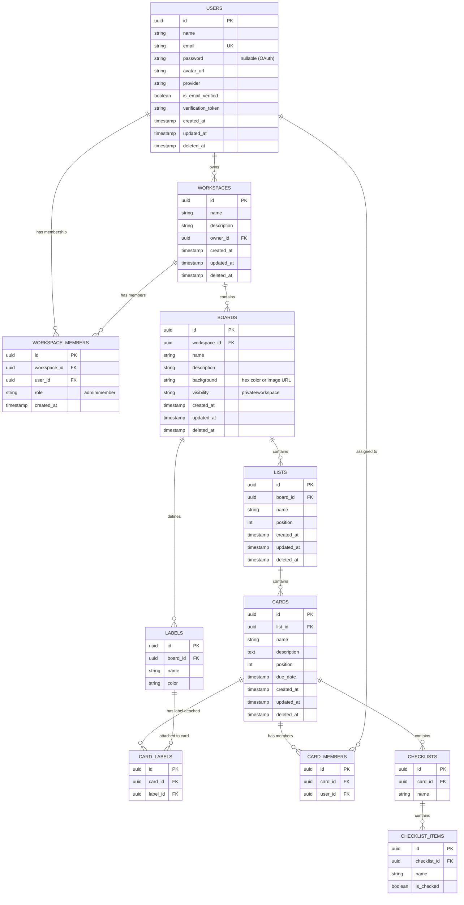

# Database Entity Relationship Diagram (ERD)

This document describes the relational database schema design for the Trello Clone project. The database contains structures for managing users, workspaces, memberships, boards, lists, cards, checklist items, and tags (labels).

## Entity Relationship Diagram (Mermaid)

---

## Detailed Data Dictionary & Schemas

### 1. `users` Table
Stores authentication details and user profile data.
- **`id`** (UUID, Primary Key): Unique identifier generated via code before creation.
- **`name`** (VARCHAR(255), Not Null): The full name of the user.
- **`email`** (VARCHAR(255), Unique Index, Not Null): Email address used for authentication.
- **`password`** (VARCHAR(255), Nullable): Hashed password. Empty if registered via Google OAuth.
- **`avatar_url`** (VARCHAR(512), Nullable): Link to the avatar image (e.g., Cloudflare R2 bucket link).
- **`provider`** (VARCHAR(50), Default `'local'`): The signup source (`local` or `google`).
- **`is_email_verified`** (BOOLEAN, Default `false`): Verification status.
- **`verification_token`** (VARCHAR(255), Nullable): Token used during email validation.
- **`created_at` / `updated_at` / `deleted_at`**: Audit timestamps for soft deletes.

### 2. `workspaces` Table
Represents logical organization units containing boards.
- **`id`** (UUID, Primary Key)
- **`name`** (VARCHAR(255), Not Null): Name of the workspace.
- **`description`** (VARCHAR(1000), Nullable): Descriptive summary of the workspace.
- **`owner_id`** (UUID, Foreign Key → `users.id`): References the user who owns this workspace.

### 3. `workspace_members` Table
Represents user access levels within specific workspaces.
- **`id`** (UUID, Primary Key)
- **`workspace_id`** (UUID, Foreign Key → `workspaces.id`): Associated workspace.
- **`user_id`** (UUID, Foreign Key → `users.id`): Associated user.
- **`role`** (VARCHAR(50), Default `'member'`): Access level control (`admin` or `member`).

### 4. `boards` Table
Project dashboards nested inside workspaces.
- **`id`** (UUID, Primary Key)
- **`workspace_id`** (UUID, Foreign Key → `workspaces.id`): Project location.
- **`name`** (VARCHAR(255), Not Null): Title of the board.
- **`description`** (VARCHAR(1000), Nullable): Summary description.
- **`background`** (VARCHAR(512), Default `'#1e3a5f'`): Hex color code or Cloudflare R2 image link.
- **`visibility`** (VARCHAR(50), Default `'workspace'`): Access scope (`private` or `workspace`).

### 5. `lists` Table
Represents workflow columns on a board.
- **`id`** (UUID, Primary Key)
- **`board_id`** (UUID, Foreign Key → `boards.id`): Associated board.
- **`name`** (VARCHAR(255), Not Null): e.g. "To Do", "In Progress".
- **`position`** (INT, Default `0`): Double-precision sorting position used to manage order in drag-and-drop.

### 6. `cards` Table
Task entities nested inside lists.
- **`id`** (UUID, Primary Key)
- **`list_id`** (UUID, Foreign Key → `lists.id`): Associated list container.
- **`name`** (VARCHAR(255), Not Null): Task summary.
- **`description`** (TEXT, Nullable): Long form task specifications.
- **`position`** (INT, Default `0`): Drag-and-drop sort position.
- **`due_date`** (TIMESTAMP, Nullable): Optional task completion target target date.

### 7. `checklists` Table
Groups checklists within tasks.
- **`id`** (UUID, Primary Key)
- **`card_id`** (UUID, Foreign Key → `cards.id`): Associated card.
- **`name`** (VARCHAR(255), Not Null): Title of the checklist (e.g. "QA Steps").

### 8. `checklist_items` Table
Individual items within a checklist.
- **`id`** (UUID, Primary Key)
- **`checklist_id`** (UUID, Foreign Key → `checklists.id`): Parent checklist.
- **`name`** (VARCHAR(255), Not Null): Specific task criteria.
- **`is_checked`** (BOOLEAN, Default `false`): Verification status.

### 9. `labels` Table
Definitions of board-level colored tags.
- **`id`** (UUID, Primary Key)
- **`board_id`** (UUID, Foreign Key → `boards.id`): Board the label is defined for.
- **`name`** (VARCHAR(100), Nullable): Visual tag name (e.g., "Critical").
- **`color`** (VARCHAR(50), Not Null): Visual hex code color.

### 10. `card_labels` Table
Association table attaching labels to cards.
- **`id`** (UUID, Primary Key)
- **`card_id`** (UUID, Foreign Key → `cards.id`): Associated card.
- **`label_id`** (UUID, Foreign Key → `labels.id`): Attached label.
