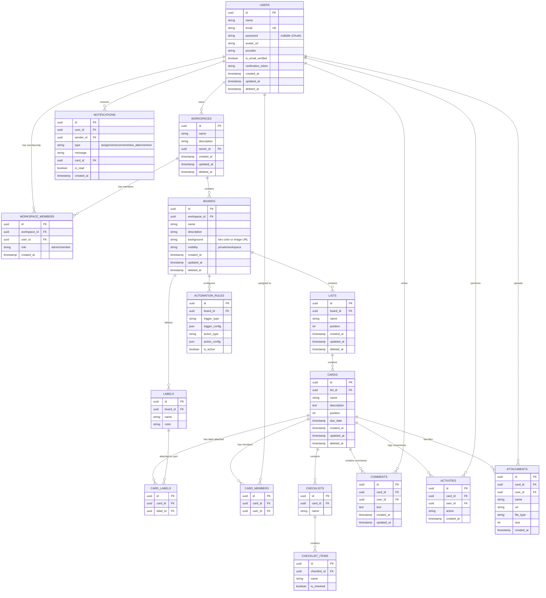

# Database Entity Relationship Diagram (ERD)

This document describes the relational database schema design for the Trello Clone project. The database contains structures for managing users, workspaces, memberships, boards, lists, cards, checklists, tags (labels), comments, activities, notifications, attachments, and automation rules.

## Entity Relationship Diagram (Mermaid)

---

## Detailed Data Dictionary & Schemas

### 1. `users` Table
Stores authentication details and user profile data.
- **`id`** (UUID, Primary Key)
- **`name`** (VARCHAR(255), Not Null)
- **`email`** (VARCHAR(255), Unique Index, Not Null)
- **`password`** (VARCHAR(255), Nullable)
- **`avatar_url`** (VARCHAR(512), Nullable)
- **`provider`** (VARCHAR(50), Default `'local'`)
- **`is_email_verified`** (BOOLEAN, Default `false`)
- **`verification_token`** (VARCHAR(255), Nullable)
- **`created_at` / `updated_at` / `deleted_at`**

### 2. `workspaces` Table
Logical organization units containing boards.
- **`id`** (UUID, Primary Key)
- **`name`** (VARCHAR(255), Not Null)
- **`description`** (VARCHAR(1000), Nullable)
- **`owner_id`** (UUID, Foreign Key → `users.id`)

### 3. `workspace_members` Table
User access levels within specific workspaces.
- **`id`** (UUID, Primary Key)
- **`workspace_id`** (UUID, Foreign Key → `workspaces.id`)
- **`user_id`** (UUID, Foreign Key → `users.id`)
- **`role`** (VARCHAR(50), Default `'member'`)

### 4. `boards` Table
Project dashboards nested inside workspaces.
- **`id`** (UUID, Primary Key)
- **`workspace_id`** (UUID, Foreign Key → `workspaces.id`)
- **`name`** (VARCHAR(255), Not Null)
- **`description`** (VARCHAR(1000), Nullable)
- **`background`** (VARCHAR(512), Default `'#1e3a5f'`)
- **`visibility`** (VARCHAR(50), Default `'workspace'`)

### 5. `lists` Table
Workflow columns on a board.
- **`id`** (UUID, Primary Key)
- **`board_id`** (UUID, Foreign Key → `boards.id`)
- **`name`** (VARCHAR(255), Not Null)
- **`position`** (INT, Default `0`)

### 6. `cards` Table
Task entities nested inside lists.
- **`id`** (UUID, Primary Key)
- **`list_id`** (UUID, Foreign Key → `lists.id`)
- **`name`** (VARCHAR(255), Not Null)
- **`description`** (TEXT, Nullable)
- **`position`** (INT, Default `0`)
- **`due_date`** (TIMESTAMP, Nullable)

### 7. `checklists` Table
Groups checklists within tasks.
- **`id`** (UUID, Primary Key)
- **`card_id`** (UUID, Foreign Key → `cards.id`)
- **`name`** (VARCHAR(255), Not Null)

### 8. `checklist_items` Table
Individual items within a checklist.
- **`id`** (UUID, Primary Key)
- **`checklist_id`** (UUID, Foreign Key → `checklists.id`)
- **`name`** (VARCHAR(255), Not Null)
- **`is_checked`** (BOOLEAN, Default `false`)

### 9. `labels` Table
Definitions of board-level colored tags.
- **`id`** (UUID, Primary Key)
- **`board_id`** (UUID, Foreign Key → `boards.id`)
- **`name`** (VARCHAR(100), Nullable)
- **`color`** (VARCHAR(50), Not Null)

### 10. `card_labels` Table
Association table attaching labels to cards.
- **`id`** (UUID, Primary Key)
- **`card_id`** (UUID, Foreign Key → `cards.id`)
- **`label_id`** (UUID, Foreign Key → `labels.id`)

---

## Extensions for Phase 6, 7, & 8

### 11. `comments` Table
Stores comments left by users inside cards.
- **`id`** (UUID, Primary Key)
- **`card_id`** (UUID, Foreign Key → `cards.id`): Associated card.
- **`user_id`** (UUID, Foreign Key → `users.id`): Author of the comment.
- **`text`** (TEXT, Not Null): Comment text content.
- **`created_at` / `updated_at`** (TIMESTAMP): Creation and edit timings.

### 12. `activities` Table
Logs action history (audit trail) of movements and alterations of cards.
- **`id`** (UUID, Primary Key)
- **`card_id`** (UUID, Foreign Key → `cards.id`): Target card.
- **`user_id`** (UUID, Foreign Key → `users.id`): User who performed the action.
- **`action`** (VARCHAR(255), Not Null): Human readable activity description (e.g., "moved this card to In Progress").
- **`created_at`** (TIMESTAMP): Time of activity.

### 13. `notifications` Table
Stores notification triggers dispatched to users (in-app bell inbox).
- **`id`** (UUID, Primary Key)
- **`user_id`** (UUID, Foreign Key → `users.id`): Notification recipient.
- **`sender_id`** (UUID, Foreign Key → `users.id`, Nullable): Action triggerer.
- **`type`** (VARCHAR(50), Not Null): Notification types (`assignment`, `comment`, `due_date`, `mention`).
- **`message`** (VARCHAR(512), Not Null): Descriptive text summary.
- **`card_id`** (UUID, Foreign Key → `cards.id`, Nullable): Related card context.
- **`is_read`** (BOOLEAN, Default `false`): Checked status.
- **`created_at`** (TIMESTAMP): Timestamp of dispatch.

### 14. `attachments` Table
Metadata for files uploaded to Cloudflare R2 bucket.
- **`id`** (UUID, Primary Key)
- **`card_id`** (UUID, Foreign Key → `cards.id`): Card containing the file.
- **`user_id`** (UUID, Foreign Key → `users.id`): Uploader.
- **`name`** (VARCHAR(255), Not Null): Filename.
- **`url`** (VARCHAR(512), Not Null): Public cloud download/rendering path.
- **`file_type`** (VARCHAR(100), Not Null): MIME file type.
- **`size`** (INT, Not Null): Size in bytes.
- **`created_at`** (TIMESTAMP)

### 15. `automation_rules` Table
Automation settings configured per Board.
- **`id`** (UUID, Primary Key)
- **`board_id`** (UUID, Foreign Key → `boards.id`): Rules scope.
- **`trigger_type`** (VARCHAR(100), Not Null): Trigger identifiers (e.g., `"checklist_completed"`, `"card_moved"`).
- **`trigger_config`** (JSON, Not Null): Details of criteria.
- **`action_type`** (VARCHAR(100), Not Null): Operation to execute (e.g., `"move_card_to_list"`).
- **`action_config`** (JSON, Not Null): Execution details.
- **`is_active`** (BOOLEAN, Default `true`)
