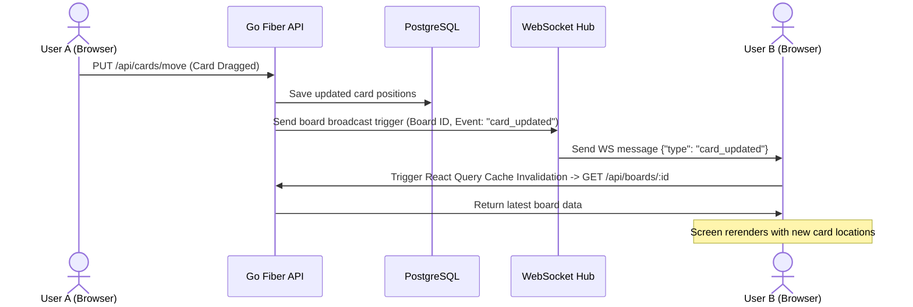
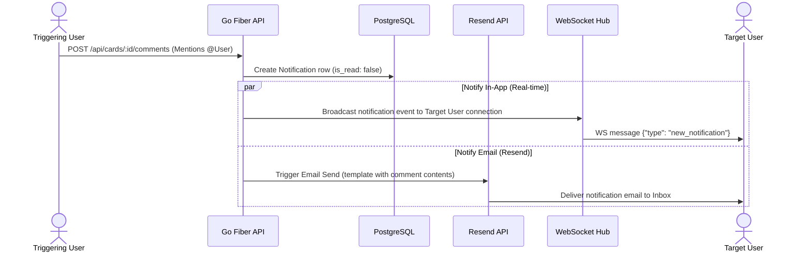
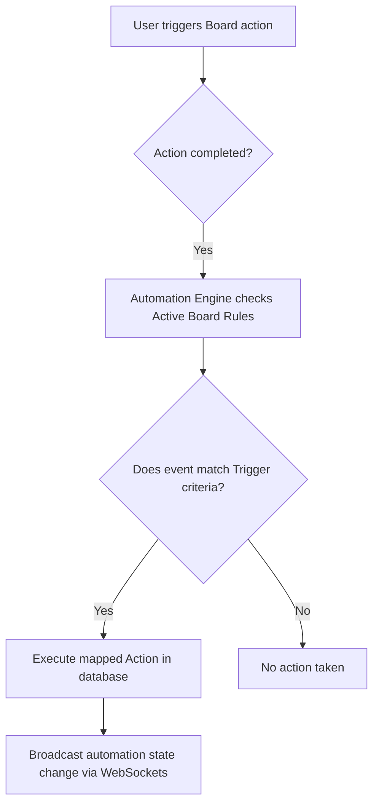

# Functional Specification Document (FSD)

This document specifies the functional requirements, system logic, API routing interfaces, and technical flows for the Trello Clone project.

---

## 1. System Modules & Functional Requirements

The system consists of three core entry points: the **Go Backend**, the **Next.js Web Client**, and the **React Native Mobile App**.

### 1.1 Authentication & User Management
- **Local Signup / Sign-in**: Users can register and authenticate using an email and password.
- **Google OAuth**: Users can log in using Google OAuth credentials (web client).
- **Session Security**: 
  - The backend issues JWT tokens upon successful login.
  - The web client stores JWTs securely.
  - The mobile client persists JWT tokens locally using `AsyncStorage`.
- **User Context**: Both clients query `/api/auth/me` on startup to verify state and fetch user details (avatar, name).

### 1.2 Workspace & Board Management
- **Workspaces**:
  - Logical groups of project boards.
  - Users can create, update, and delete workspaces.
  - Workspaces support inviting members (with roles: `admin` or `member`).
- **Boards**:
  - Boards exist inside workspaces.
  - Users can create new boards with customizable solid color backgrounds (or hex codes).
  - Boards have visibility flags (`private` vs. `workspace`).

### 1.3 Trello Board Canvas (Lists & Cards)
- **Lists (Columns)**:
  - Columns (e.g. "To Do", "Doing", "Done") added to a board.
  - Users can create lists, edit their names, and delete them.
  - Lists contain cards ordered by an integer `position` property.
- **Cards (Tasks)**:
  - Inside a list, users can create cards.
  - **Drag and Drop (Dnd)**: Cards and lists can be dragged horizontally or vertically. Dragging reorders positions and triggers updates persisting order to the PostgreSQL database.
  - **Card Detail View (Modal)**: Clicking a card opens detailed configurations:
    - **Description**: Markdown or plaintext description of the task.
    - **Due Date**: Date selector attaching calendar dates to tasks.
    - **Labels**: Custom color tags (hex value) representing priorities/attributes.
    - **Checklists**: Nested checklists where items can be added and toggled to track sub-task completion.

### 1.4 Real-time Synchronization
- **WebSocket Hub**:
  - The backend runs a concurrent goroutine hub mapping client connections to specific board IDs.
  - When User A performs a mutations (moves card, adds checklist, reorders list), the backend database changes are broadcast as JSON messages to all other WebSocket connections active on that board.
  - The web client receives the socket message and immediately triggers React Query cache invalidation to re-fetch and render the latest board state without requiring manual screen refreshes.

### 1.5 Comments & Activity History (Phase 6)
- **Card Comments**: Users assigned to a board can write, edit, and delete comments on individual cards. Comments are logged sequentially.
- **Activity logs**: A read-only historical timeline tracking card events (e.g., "User X moved card from To Do to In Progress", "User Y changed the due date").

### 1.6 Notifications Engine & Email Alerts (Phase 6)
- **In-App Bell Panel**: Displays unread notifications. Triggers include:
  - Being assigned/removed from a card.
  - Mentions in comments (e.g. "@username").
  - Due date warnings (24 hours prior to deadline).
- **Email Notifications (Resend)**:
  - Triggered concurrently when in-app notifications are dispatched.
  - A background cron worker in Go runs daily to scan the database for cards approaching their `due_date` within 24 hours, emailing a reminder to all assigned card members.

### 1.7 Cloudflare R2 Attachments (Phase 7)
- **File Uploads**: Cards support attachments (PDFs, docs, images). Files are uploaded to Cloudflare R2 bucket.
- **Card Cover**: Image attachments can be set as the visual cover of cards displayed on the board canvas.

### 1.8 Board Automation (Phase 8)
- **Butler Rules**: Users can configure simple reactive automation rules for their boards, matching a **Trigger** to an **Action**.
  - **Triggers**: Checklist completed (100%), Card moved into list X, or Label applied.
  - **Actions**: Move card to list Y, mark card due date as complete, or assign user Z.

---

## 2. API Routing Specification

### 2.1 Authentication
- `POST /api/auth/register` (Public) - Register new user.
- `POST /api/auth/login` (Public) - User login.
- `GET /api/auth/me` (Protected) - Fetches authenticated user info.

### 2.2 Workspaces
- `GET /api/workspaces` (Protected) - Fetch workspaces.
- `POST /api/workspaces` (Protected) - Create new workspace.

### 2.3 Boards
- `GET /api/boards/workspace/:workspaceId` (Protected) - Fetch boards.
- `GET /api/boards/:id` (Protected) - Fetch full details of a board.
- `POST /api/boards` (Protected) - Create new board.

### 2.4 Lists
- `POST /api/lists` (Protected) - Create new list.
- `PUT /api/lists/:id` (Protected) - Edit list details.
- `PUT /api/lists/move` (Protected) - Updates order position of lists.
- `DELETE /api/lists/:id` (Protected) - Delete list.

### 2.5 Cards & Detail Features
- `POST /api/cards` (Protected) - Create new card.
- `PUT /api/cards/:id` (Protected) - Update card metadata.
- `PUT /api/cards/move` (Protected) - Moves cards between positions/lists.
- `DELETE /api/cards/:id` (Protected) - Delete card.
- `POST /api/cards/:id/labels` (Protected) - Add label.
- `DELETE /api/cards/:id/labels/:labelId` (Protected) - Remove label.
- `POST /api/cards/:id/checklists` (Protected) - Add new checklist.
- `POST /checklists/:id/items` (Protected) - Add item.
- `PUT /checklists/items/:id` (Protected) - Toggle/check off item.
- `DELETE /checklists/:id` (Protected) - Delete checklist.

### 2.6 Comments, Activities, & Notifications (Phase 6)
- `POST /api/cards/:id/comments` (Protected) - Post a new comment.
- `DELETE /api/comments/:id` (Protected) - Delete a comment.
- `GET /api/cards/:id/activities` (Protected) - Fetch activity history for a card.
- `GET /api/notifications` (Protected) - Get unread notifications for active user.
- `PUT /api/notifications/:id/read` (Protected) - Mark specific notification as read.
- `PUT /api/notifications/read-all` (Protected) - Mark all notifications as read.

### 2.7 Attachments (Phase 7)
- `POST /api/cards/:id/attachments` (Protected) - Upload file attachment.
- `DELETE /api/attachments/:id` (Protected) - Delete file attachment.
- `PUT /api/cards/:id/cover` (Protected) - Select an attachment to serve as cover.

### 2.8 Automation Rules (Phase 8)
- `GET /api/boards/:id/automation-rules` (Protected) - Get board automation rules.
- `POST /api/boards/:id/automation-rules` (Protected) - Add an automation rule.
- `PUT /api/automation-rules/:id` (Protected) - Update rule status/criteria.
- `DELETE /api/automation-rules/:id` (Protected) - Delete rule.

---

## 3. Core System Data Flows

### 3.1 Real-Time Modification Flow

### 3.2 Notification Dispatching Flow (In-App + Resend Email)

### 3.3 Rule Automation Engine Flow

